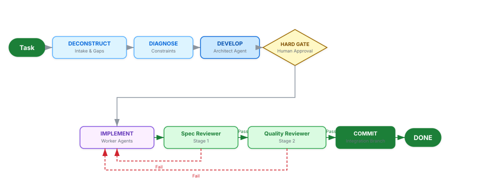

# Superpipelines: Multi-Agent Orchestration Across AI Coding Platforms

Superpipelines turns AI coding assistants from chaotic generators into disciplined engineering teams. It enforces isolated code reviews, prevents infinite loops, guarantees persistent state across mid-session crashes, and removes the manual overhead of verifying every generated output. As of v2.0.0, the same pipeline scaffolds run unmodified across Claude Code, OpenCode, Codex App/CLI, Cursor, Windsurf, Cline, and Antigravity CLI 2.0.

[](https://opensource.org/licenses/MIT)
[](https://github.com/gustavo-meilus/superpipelines/actions/workflows/ci.yml)

---

## Quick Start

Step 1: Install (universal — auto-detects your platform)

```bash
# POSIX (macOS/Linux)
curl -fsSL https://raw.githubusercontent.com/gustavo-meilus/superpipelines/main/install.sh | bash

# Windows PowerShell
irm https://raw.githubusercontent.com/gustavo-meilus/superpipelines/main/install.ps1 | iex

# Or via npm (any platform with Node ≥18)
npx -y superpipelines-install
```

Platform-specific install commands:

| Platform | Install |
| :--- | :--- |
| Claude Code | `claude plugin install github:gustavo-meilus/superpipelines` |
| Codex App/CLI | `codex plugin add github:gustavo-meilus/superpipelines` (syntax pending verification — see RELEASE-NOTES) |
| Antigravity 2.0 | `agy plugin install github:gustavo-meilus/superpipelines` |
| Cursor / Windsurf / Cline | `npx -y skills add superpipelines -a <cursor\|windsurf\|cline>` |

Step 2: Create your first pipeline

```
/superpipelines:new-pipeline
```

Step 3: Run it

```
/superpipelines:run-pipeline
```

The system handles spec generation, agent coordination, state persistence, and crash recovery without requiring additional configuration.

---

## Architecture

<picture>
  <source media="(prefers-color-scheme: dark)" srcset="assets/architecture-dark.svg">
  
</picture>

By operating with `disallowedTools: Write, Edit, Bash`, the reviewer agent cannot rationalize its way into modifying code. The only outputs it can produce are a passing verdict or an explicit failure that halts the pipeline. On platforms that support structural isolation (Claude Code, OpenCode, Codex), this constraint is enforced at the permission layer. On Cursor, Windsurf, and Cline (Tier 2), the same protocol runs as a convention — surfaced explicitly at run start and end so reviewers know reviews are advisory rather than structurally guaranteed.

### Platform Tiers

| Tier | Platforms | Subagent Dispatch | Reviewer Isolation |
| :--- | :--- | :--- | :--- |
| **1** | Claude Code | Native `Task()` | Structural (`tools:` restriction) |
| **1b** | OpenCode | `mode: subagent` | Structural (`permission: { edit: deny }`) |
| **1c** | Antigravity CLI 2.0 | Dynamic Subagents *(aspirational)* | Unverified |
| **1d** | Codex App/CLI | Model-driven, up to 6 concurrent | TOML `sandbox_mode` (`read-only` structural; `workspace-write` requires Hyper-V) |
| **2** | Cursor, Windsurf, Cline | Single-agent inline loop | Convention-only (advisory) |

Pipelines scaffolded on Tier 1 (Claude Code) or Tier 1d (Codex) run on Tier 2 platforms without modification — `sk-platform-dispatch` rewrites paths at read/write time.

---

## Capabilities

Tasks decompose before execution into a precise specification and an itemized task list. This decomposition phase surfaces ambiguities and architectural gaps that would otherwise cause costly failures deep in the implementation cycle, especially when an agent encounters a constraint that never appeared in the initial intake. Reviewer agents cannot modify the code they validate.

Isolation sits at the permission layer, not at the convention level. This distinction matters because a model under conventional role guidance can rationalize a targeted edit when the fix appears trivial, but a model under hard permission constraints cannot generate write operations at all. And most teams hit this failure mode only after a reviewer patches the audited file. Pipeline state persists to scope-aware temporary directories throughout execution, and a mid-session crash does not discard completed work because execution resumes automatically from the last stable checkpoint without triggering a full restart. Hard-coded iteration caps prevent runaway repair cycles. Human gates enforce additional stops at high-stakes transitions, requiring explicit approval before the pipeline advances to irreversible phases and blocking model rationalization from overriding defined stopping conditions.

---

## Execution Workflow

Execution follows a nine-phase lifecycle, with mandatory validation between implementation and integration:

<!-- <workflow_matrix> -->
| Phase | Process Flow | Description |
| :--- | :--- | :--- |
| **1.&nbsp;DECONSTRUCT** | Intake&nbsp;→&nbsp;Gap&nbsp;Analysis | Identifies gaps and ambiguities through targeted intake, surfacing constraints before execution. |
| **2.&nbsp;DIAGNOSE** | Environment&nbsp;→&nbsp;Constraints | Surfaces environmental and architectural constraints before code generation. |
| **3.&nbsp;DEVELOP** | Architect&nbsp;→&nbsp;Spec/Plan/Tasks | `pipeline-architect` generates `spec.md`, `plan.md`, and `tasks.md`. |
| **4.&nbsp;HARD&nbsp;GATE** | Execution&nbsp;→&nbsp;Gate&nbsp;→&nbsp;Approval | Execution pauses for human review and approval of the specification. |
| **5.&nbsp;IMPLEMENT** | Tasks&nbsp;→&nbsp;Worker&nbsp;Agents | Worker agents execute tasks in isolated git worktrees. |
| **6.&nbsp;STAGE&nbsp;1** | Output&nbsp;→&nbsp;Spec&nbsp;Validator | `pipeline-spec-reviewer` validates output against the specification. |
| **7.&nbsp;STAGE&nbsp;2** | Stage&nbsp;1&nbsp;Pass&nbsp;→&nbsp;Quality&nbsp;Audit | `pipeline-quality-reviewer` performs a code quality audit (only after Stage 1 passes). |
| **8.&nbsp;COMMIT** | Passing&nbsp;Tasks&nbsp;→&nbsp;Integration | Passing tasks merge to the integration branch. |
| **9.&nbsp;DONE** | Cleanup&nbsp;→&nbsp;Summary | Temporary state is cleaned and a completion summary is surfaced. |
<!-- </workflow_matrix> -->

---

## Execution Patterns

The framework selects the optimal pattern based on task complexity:

<!-- <pattern_matrix> -->
| Pattern | Shape | Use Case |
| :--- | :--- | :--- |
| **1.&nbsp;Sequential** | A&nbsp;→&nbsp;B&nbsp;→&nbsp;C | Ordered phases with hard data dependencies. |
| **2.&nbsp;Parallel&nbsp;Fan-Out** | A&nbsp;→&nbsp;[B,&nbsp;C,&nbsp;D]&nbsp;→&nbsp;Merger | Independent branches that merge upon completion. |
| **3.&nbsp;Iterative&nbsp;Loop** | Implement&nbsp;→&nbsp;Test&nbsp;→&nbsp;Fix | Test-driven repair with a hard escalation cap of 3 iterations. |
| **4.&nbsp;Human-Gated** | Agent&nbsp;→&nbsp;Gate&nbsp;→&nbsp;Agent | High-stakes stages requiring manual approval. |
| **5.&nbsp;Spec-Driven&nbsp;Dev** | Spec&nbsp;→&nbsp;Tasks&nbsp;→&nbsp;2-Stage&nbsp;Review | Full SDD with worktrees per task. |
| **6.&nbsp;4D&nbsp;Wrapper** | 4D&nbsp;Intake&nbsp;→&nbsp;Pattern | Wraps any pattern with structured deconstruction. |
<!-- </pattern_matrix> -->

---

## Slash Commands

| Command | Function |
| :--- | :--- |
| `/superpipelines:new-pipeline` | Initiates 4D intake and generates pipeline artifacts. |
| `/superpipelines:run-pipeline` | Orchestrates an existing pipeline end-to-end. |
| `/superpipelines:new-step` | Adds a new step to an existing named pipeline. |
| `/superpipelines:update-step` | Modifies an existing step within a named pipeline. |
| `/superpipelines:delete-step` | Removes a step from a named pipeline with gap analysis. |
| `/superpipelines:audit-steps` | Audits agents and skills against the v2 compliance matrix. |

---

## Design Principles

Permission boundaries are enforced at the agent definition level, not by prompt instruction. But the constraint preventing reviewers from modifying code sits in the permission schema, not in a system prompt that a sufficiently confident model can talk itself around. Every agent declares a `permissionMode`, and bypassing it requires explicit documented justification.

Pipeline state persists to a deterministic path at `<scope-root>/superpipelines/temp/{P}/{runId}/pipeline-state.json`. Resumption resets any in-progress phases to their initial state while preserving all completed work, which means a crashed session picks back up without re-running the intake or architecture phases that already passed validation. High-density reference documentation lives in companion `*-references/` directories and loads on demand. This strategy prevents token-heavy reference payloads from bloating the active session window during phases that do not need deep technical detail. Practitioners commonly underestimate how quickly context saturation degrades output quality on long pipelines. Keeping reference data out of the primary context until it is needed is one of the highest-return optimizations available without modifying the underlying model configuration.

---

## Repository Layout

<!-- <file_structure> -->
```
superpipelines/
├── .claude-plugin/           # Claude Code manifest + marketplace data
├── .codex-plugin/            # Codex App/CLI manifest
├── .cursor-plugin/           # Cursor / Windsurf / Cline manifest
├── gemini-extension.json     # Antigravity CLI 2.0 extension manifest
├── agents/                   # Core agent definitions (zero-body; Lean Agent pattern)
├── skills/                   # Intelligence layer — skills hold the orchestration logic
│   ├── sk-platform-dispatch/ # Tier detection + DISPATCH contract + Tier 2 inline loop
│   ├── *-protocol/           # Per-agent protocol skills (companion to zero-body agents)
│   ├── *-references/         # Deep reference libraries (on-demand loading)
├── commands/                 # Slash command wrappers
├── hooks/                    # SessionStart hooks (per-platform variants)
├── bin/install.js            # Universal Node installer (7 platforms auto-detected)
├── install.sh / install.ps1  # POSIX + PowerShell installer wrappers
├── AGENTS.md                 # Universal context (any AGENTS.md-aware tool)
├── GEMINI.md                 # Antigravity-specific context
├── CLAUDE.md                 # Claude Code project reference + invariants
│
│   ── Scope-local pipeline artifacts (generated at install / pipeline-create time) ──
│
├── .claude/                  # Claude Code scope root (Tier 1)
│   ├── agents/superpipelines/# Zero-body agent stubs per pipeline
│   ├── skills/superpipelines/# Entry skills + companion protocol skills
│   └── superpipelines/       # registry.json + pipelines/{P}/ (topology, SDD, launcher)
├── .opencode/                # OpenCode scope root (Tier 1b)
│   ├── agents/superpipelines/# Inline-body agents (≤150 lines)
│   ├── skills/superpipelines/# Entry skills
│   └── superpipelines/       # registry.json + pipelines/{P}/
├── .agents/antigravity/      # Antigravity CLI scope root (Tier 1c)
├── .agents/codex/            # Codex App/CLI scope root (Tier 1d)
│   └── agents/superpipelines/# TOML agent files
└── .superpipelines/          # Cursor / Windsurf / Cline scope root (Tier 2)
    └── skills/superpipelines/# Protocol skills only (no agent files on Tier 2)
```
<!-- </file_structure> -->

---

## Contributing

Contributions are managed via issues and PRs at [gustavo-meilus/superpipelines](https://github.com/gustavo-meilus/superpipelines).

## License

MIT. See [LICENSE](./LICENSE).

---

## Star History

[](https://github.com/gustavo-meilus/superpipelines/stargazers)

[](https://star-history.com/#gustavo-meilus/superpipelines&Date)
