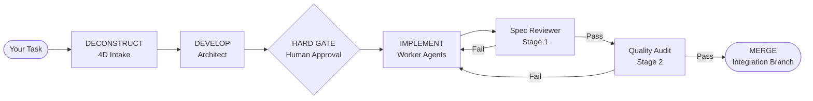

# Superpipelines — Multi-Agent Orchestration for Claude Code

Superpipelines transforms Claude Code from a chaotic generator into a disciplined engineering team. It enforces isolated code reviews, prevents infinite loops, and ensures you never lose state to a mid-generation crash via persistent JSON.

[](https://opensource.org/licenses/MIT)
[](https://github.com/gustavo-meilus/superpipelines/actions/workflows/ci.yml)
[](https://github.com/gustavo-meilus/superpipelines/stargazers)

[](https://star-history.com/#gustavo-meilus/superpipelines&Date)

---

## Quick Start

**Step 1 — Install**

```bash
claude plugin install github:gustavo-meilus/superpipelines
```

**Step 2 — Create your first pipeline**

```
/superpipelines:new-pipeline
```

**Step 3 — Run it**

```
/superpipelines:run-pipeline
```

Superpipelines handles spec generation, agent coordination, and crash recovery automatically.

---

## Architecture



The reviewer agent operates with `disallowedTools: Write, Edit, Bash` — it cannot rationalize its way into modifying code. It can only pass or fail it.

---

## Capabilities

- **Deconstruction**: Tasks decompose into a precise specification, implementation plan, and itemized task list before any code is written.
- **Write/Review Isolation**: Reviewer agents are structurally barred from modifying the code they validate. Isolation is enforced at the permission layer, not by convention.
- **State Persistence**: Pipeline state persists to scope-aware temporary directories. Crash mid-generation? Resume from the last completed phase.
- **Escalation Guards**: Hard-coded iteration caps and human gates prevent model rationalization and infinite loops.

---

## Execution Workflow

<!-- <workflow_matrix> -->
| Phase | Process Flow | Description |
| :--- | :--- | :--- |
| **1.&nbsp;DECONSTRUCT** | Intake&nbsp;→&nbsp;Gap&nbsp;Analysis | Identifies gaps, ambiguities, and constraints through targeted intake. |
| **2.&nbsp;DIAGNOSE** | Environment&nbsp;→&nbsp;Constraints | Surfaces environmental and architectural constraints before code generation. |
| **3.&nbsp;DEVELOP** | Architect&nbsp;→&nbsp;Spec/Plan/Tasks | `pipeline-architect` generates `spec.md`, `plan.md`, and `tasks.md`. |
| **4.&nbsp;HARD&nbsp;GATE** | Execution&nbsp;→&nbsp;Gate&nbsp;→&nbsp;Approval | Execution pauses for human review and approval of the specification. |
| **5.&nbsp;IMPLEMENT** | Tasks&nbsp;→&nbsp;Worker&nbsp;Agents | Worker agents execute tasks in isolated git worktrees. |
| **6.&nbsp;STAGE&nbsp;1** | Output&nbsp;→&nbsp;Spec&nbsp;Validator | `pipeline-spec-reviewer` validates output against the specification. |
| **7.&nbsp;STAGE&nbsp;2** | Stage&nbsp;1&nbsp;Pass&nbsp;→&nbsp;Quality&nbsp;Audit | `pipeline-quality-reviewer` performs a code quality audit (only after Stage 1 passes). |
| **8.&nbsp;COMMIT** | Passing&nbsp;Tasks&nbsp;→&nbsp;Integration | Passing tasks merge to the integration branch. |
| **9.&nbsp;DONE** | Cleanup&nbsp;→&nbsp;Summary | Temporary state is cleaned and a completion summary is surfaced. |
<!-- </workflow_matrix> -->

---

## Execution Patterns

The framework selects the optimal pattern based on task complexity:

<!-- <pattern_matrix> -->
| Pattern | Shape | Use Case |
| :--- | :--- | :--- |
| **1.&nbsp;Sequential** | A&nbsp;→&nbsp;B&nbsp;→&nbsp;C | Ordered phases with hard data dependencies. |
| **2.&nbsp;Parallel&nbsp;Fan-Out** | A&nbsp;→&nbsp;[B,&nbsp;C,&nbsp;D]&nbsp;→&nbsp;Merger | Independent branches that merge upon completion. |
| **3.&nbsp;Iterative&nbsp;Loop** | Implement&nbsp;→&nbsp;Test&nbsp;→&nbsp;Fix | Test-driven repair with a hard escalation cap of 3 iterations. |
| **4.&nbsp;Human-Gated** | Agent&nbsp;→&nbsp;Gate&nbsp;→&nbsp;Agent | High-stakes stages requiring manual approval. |
| **5.&nbsp;Spec-Driven&nbsp;Dev** | Spec&nbsp;→&nbsp;Tasks&nbsp;→&nbsp;2-Stage&nbsp;Review | Full SDD with worktrees per task. |
| **6.&nbsp;4D&nbsp;Wrapper** | 4D&nbsp;Intake&nbsp;→&nbsp;Pattern | Wraps any pattern with structured deconstruction. |
<!-- </pattern_matrix> -->

---

## Slash Commands

| Command | Function |
| :--- | :--- |
| `/superpipelines:new-pipeline` | Initiates 4D intake and generates pipeline artifacts. |
| `/superpipelines:run-pipeline` | Orchestrates an existing pipeline end-to-end. |
| `/superpipelines:new-step` | Adds a new step to an existing named pipeline. |
| `/superpipelines:update-step` | Modifies an existing step within a named pipeline. |
| `/superpipelines:delete-step` | Removes a step from a named pipeline with gap analysis. |
| `/superpipelines:audit-pipeline` | Audits agents and skills against the v2 compliance matrix. |

---

## Design Principles

- **Structural Isolation**: Permission boundaries are enforced at the agent definition level. Reviewers cannot rationalize their way into "fixing" code; they can only fail it.
- **Scope-Aware State**: Pipeline state persists to `<scope-root>/superpipelines/temp/{P}/{runId}/pipeline-state.json`. Resumption resets in-progress phases while preserving completed work.
- **Permission Granularity**: Every agent declares a `permissionMode` (e.g., `acceptEdits`, `plan`). Bypassing permissions requires explicit, documented justification.
- **Progressive Disclosure**: High-density reference documentation resides in companion `*-references/` directories and is loaded on demand to minimize context bloat.

---

## Repository Layout

<!-- <file_structure> -->
```
superpipelines/
├── .claude-plugin/           # Plugin manifest and marketplace data
├── agents/                   # Core agent definitions (Architect, Auditor, Executor, Reviewers)
├── skills/                   # Shared skills (State, Paths, Patterns, Worktree Safety)
│   ├── *-references/         # Deep reference libraries (on-demand loading)
├── commands/                 # Slash command wrappers
├── hooks/                    # SessionStart hooks for bootstrap injection
└── settings.json             # Global plugin configuration
```
<!-- </file_structure> -->

---

## Related Projects

- **[superpipelines-opencode](https://github.com/gustavo-meilus/superpipelines-opencode)** — Companion project containing the opencode implementation of the Superpipelines plugin, including alternative skill definitions, agent configurations, and pipeline artifacts for the opencode environment.

## Contributing

Contributions are managed via issues and PRs at [gustavo-meilus/superpipelines](https://github.com/gustavo-meilus/superpipelines). Use `/superpipelines:audit-pipeline` to validate additions against the compliance matrix before submission.

## License

MIT — See [LICENSE](./LICENSE).
